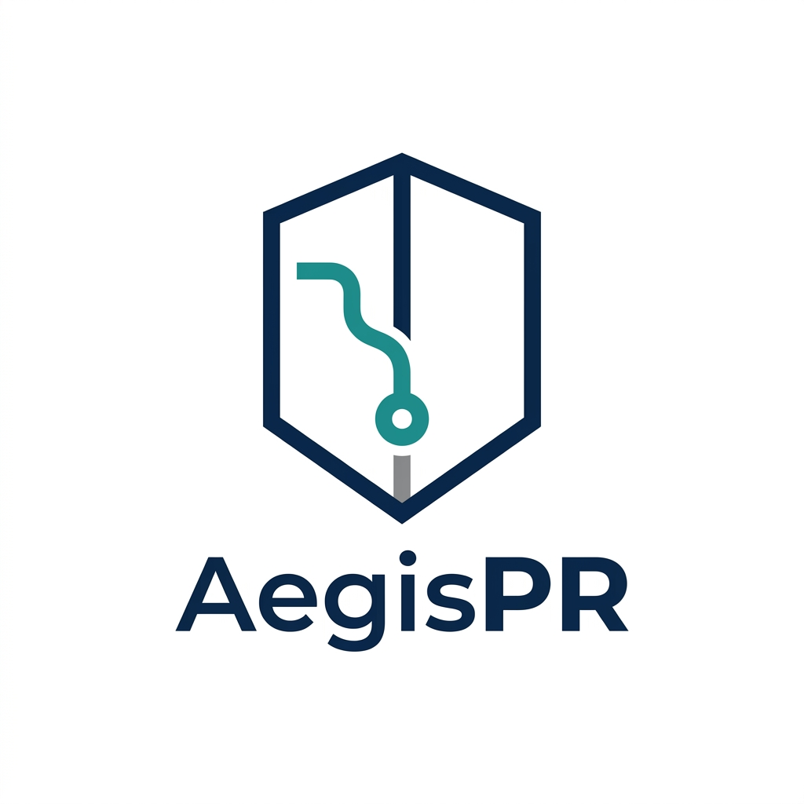

# AegisPR: AI-Driven CI/CD Code Reviewer

<p align="center">
  
</p>

An AI-driven code review and vulnerability detection agent integrated directly into the GitHub CI phase. It is designed to hunt for complex logical bugs, security flaws, and resource leaks in Open-Source Software (OSS) before code deployment.

Unlike standard static analysis tools, AegisPR uses LLM reasoning to evaluate code context, offering smart explanations and actionable remediations for vulnerabilities like SQL Injection, Command Injection, Stack Buffer Overflows, and Memory Leaks.

---

## 🚀 Features

*   **Language-Agnostic Reviews**: Automatically reviews code written in Python, C, C++, and more.
*   **Security & Logic Audit Focus**: Targets semantic flaws, context-dependent vulnerabilities (e.g. IDOR, logic bypasses, memory safety issues) rather than simple syntax or styling.
*   **Semantic Dependency Auditing**: Audits the usage semantics of third-party library imports and manifests (e.g. requirements.txt, package.json) for insecure configurations or ecosystem CVEs.
*   **Indirect Prompt Injection Defense**: Treats all diff contents as untrusted data, isolating and flagging exploit override instructions.
*   **Least-Privilege Auto-Fixes**: Integrates deterministic patch cleansing to ensure AI-suggested auto-fixes do not introduce dynamic evaluation, unvetted subprocesses, or loose system permissions.
*   **PR Integration**: Automatically scans git diffs on Pull Requests and posts detailed, markdown-formatted reviews as comments.
*   **Local Test Support**: Comes with a utility script to test the AI review locally without committing or pushing.
*   **Powered by Gemini 3.5 Flash**: Optimized for fast and intelligent code reasoning.

---

## 📁 Repository Structure

```text
├── .github/workflows/
│   └── review.yml          # GitHub Actions workflow trigger
├── src/
│   └── main.py             # Core Python logic for fetching diffs and calling Gemini API
├── action.yml              # GitHub Action definition file
├── Dockerfile              # Containerized environment for the Action runner
├── requirements.txt        # Python package dependencies (PyGithub, google-genai)
└── test_local.py           # Test script to run the AI reviewer locally on any file
```

---

## 🛠️ Local Testing

You can test the review engine locally on any code file in this repository before configuring GitHub Actions.

1.  **Install dependencies**:
    ```bash
    python3 -m pip install google-genai
    ```

2.  **Export your Gemini API Key**:
    ```bash
    export GEMINI_API_KEY="your_actual_api_key_here"
    ```

3.  **Run the local test**:
    You can run it against any code file in your repository:
    ```bash
    python3 test_local.py path/to/your/file.py
    ```

---

## ⛓️ GitHub CI/CD Integration

To run this automatically on every Pull Request in your repository:

### 1. Add the API Key to Secrets
1. Go to your repository settings on GitHub (**Settings** -> **Secrets and variables** -> **Actions**).
2. Click **New repository secret**.
3. Name: `GEMINI_API_KEY`.
4. Value: Paste your Gemini API Key.

### 2. Configure the Workflow
The project includes a pre-configured workflow in `.github/workflows/review.yml` which triggers on PR actions:

```yaml
name: "AI Code Review"

on:
  pull_request:
    types: [opened, synchronize, reopened]

jobs:
  ai_review:
    runs-on: ubuntu-latest
    permissions:
      contents: read
      pull-requests: write # Required for the bot to write PR comments
    steps:
      - name: Checkout Code
        uses: actions/checkout@v5 # Targets Node 24
      
      - name: Run AegisPR
        uses: ./ # Uses action.yml in root
        with:
          github_token: ${{ secrets.GITHUB_TOKEN }}
          gemini_api_key: ${{ secrets.GEMINI_API_KEY }}
```

Whenever a new Pull Request is opened or updated, **AegisPR** will review the diff and post its analysis directly in the PR timeline.
