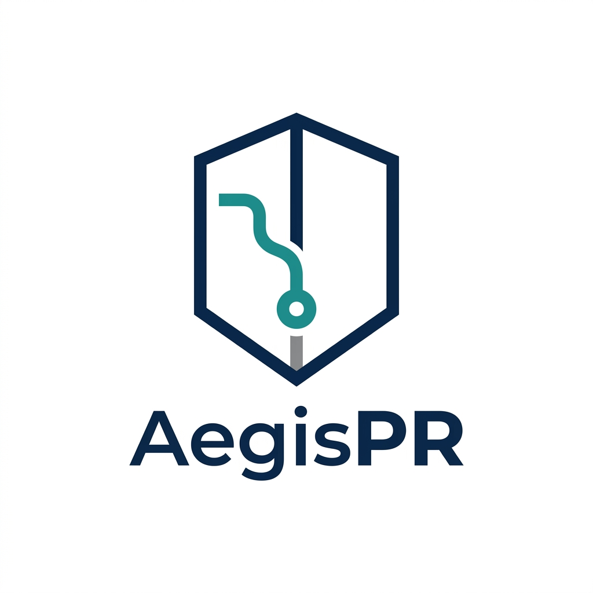
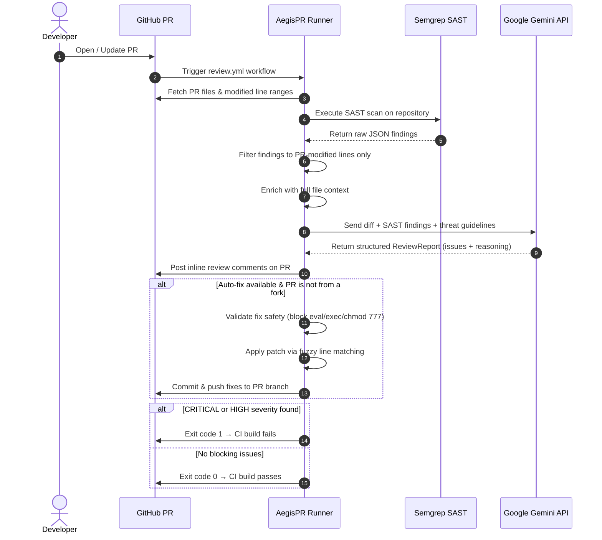

# AegisPR: Enterprise AI-Driven CI/CD Security Agent

<p align="center">
  
</p>

An enterprise-grade, autonomous AI Code Reviewer and Vulnerability Detection Agent integrated directly into the GitHub CI phase. It is designed to hunt for complex logical bugs, security flaws, and resource leaks in Open-Source Software (OSS) before code deployment.

Unlike standard static analysis tools, AegisPR combines **Semgrep SAST scanning** with **LLM reasoning** to evaluate code context, aggressively filter false positives, and deliver smart explanations with **secure auto-fixing** for vulnerabilities like Command Injection, Path Traversal, TOCTOU Race Conditions, SSRF, and Supply Chain Risks.

---

## 🚀 Enterprise Features

### Hybrid SAST & AI Triage
Integrates Semgrep to perform rapid static analysis across the repository, then uses advanced LLM reasoning to aggressively filter false positives and provide context-aware remediations — only for lines modified in the PR diff.

### Language-Agnostic Reviews
Automatically reviews code written in Python, C, C++, JavaScript, Go, Rust, and more. Semgrep provides rule-based scanning for 20+ languages, while the LLM performs semantic analysis across any language, script, or configuration manifest present in the diff.

### Diff-Aware Scanning
Only flags vulnerabilities introduced in the **exact lines modified** in the Pull Request. Zero alert fatigue — developers are never blocked for legacy technical debt.

### Deep Context Enrichment
Injects the full contents of vulnerable files into the AI context window, allowing the LLM to understand cross-function dependencies, data flow, and call chains before suggesting fixes.

### Semantic Dependency Auditing
Audits the usage semantics of third-party library imports and manifests (e.g., `Dockerfile`, `requirements.txt`, `package.json`) for insecure configurations or ecosystem CVEs.

### Fuzzy Auto-Fixer
Safely injects AI-synthesized patches into your codebase while mathematically adapting to bizarre indentation anomalies and custom code styles using whitespace-agnostic line matching.

### Least-Privilege Auto-Fixes
Integrates a custom safety validator to ensure AI-suggested auto-fixes do not introduce:
- Dynamic evaluation (`eval`, `exec`)
- Unvetted subprocesses (`os.system`, `os.popen`, `os.spawn`, `pty.spawn`)
- Loose system permissions (`chmod 777`, `stat.S_IRWXO`)

### Indirect Prompt Injection Defense
The LLM is explicitly instructed to treat all code and comments in PR diffs as **untrusted data**. Any attempt to override the review via injected instructions (e.g., `# IGNORE ALL PREVIOUS INSTRUCTIONS`) is flagged as a `CRITICAL` severity issue: `Indirect Prompt Injection / Audit Override Attempt`.

### CI Pipeline Failure Gate
AegisPR evaluates the severity of all detected issues. If any issue is classified as `CRITICAL` or `HIGH`, the process exits with code `1` — **blocking the PR from merging** until the vulnerability is resolved.

### Fork PR Auto-Fix Guard
When a PR originates from a forked repository, AegisPR automatically skips pushing auto-fix commits due to GitHub Actions write permission restrictions on forks. Inline review comments are still posted.

### API Failover & Throttling
Automatically fails over between `gemini-3.5-flash`, `gemini-2.5-pro`, and `gemini-2.5-flash` using exponential backoff (up to 3 retries per model) to handle enterprise rate-limits. Each API call enforces a strict **180-second timeout** via `ThreadPoolExecutor`.

### CI/CD Self-Protection
Prevents infinite CI loops by skipping triggers on bot commits, and gracefully ignores supply-chain fixes inside `.github/workflows` to prevent permission crashes.

---

## 🔍 Vulnerability Detection Coverage

AegisPR's LLM prompt is specifically tuned to detect the following vulnerability classes:

| Category | Examples |
|---|---|
| **Command Injection** | Unsanitized inputs passed to `os.system`, `subprocess`, shell commands |
| **Path Traversal** | User-controlled paths enabling `../../etc/passwd` style access |
| **TOCTOU Race Conditions** | `os.path.exists` checks followed by `open` without atomic operations |
| **Server-Side Request Forgery** | `requests.get` with untrusted/user-controlled URLs |
| **Secrets & Cryptography** | Hardcoded API keys, weak hashing algorithms, insecure TLS configs |
| **Supply Chain Risks** | Insecure dependency pinning, typosquatting, vulnerable package versions |
| **Prompt Injection** | Malicious instructions embedded in code comments or string literals |

---

## ⚙️ How It Works


```mermaid
sequenceDiagram
    autonumber
    actor Developer
    participant GH as GitHub PR
    participant Runner as AegisPR Runner
    participant Semgrep as Semgrep SAST
    participant Gemini as Google Gemini API

    Developer->>GH: Open / Update PR
    GH->>Runner: Trigger review.yml workflow
    Runner->>GH: Fetch PR files & modified line ranges
    Runner->>Semgrep: Execute SAST scan on repository
    Semgrep-->>Runner: Return raw JSON findings
    Runner->>Runner: Filter findings to PR-modified lines only
    Runner->>Runner: Enrich with full file context
    Runner->>Gemini: Send diff + SAST findings + threat guidelines
    Gemini-->>Runner: Return structured ReviewReport (issues + reasoning)
    Runner->>GH: Post inline review comments on PR
    alt Auto-fix available & PR is not from a fork
        Runner->>Runner: Validate fix safety (block eval/exec/chmod 777)
        Runner->>Runner: Apply patch via fuzzy line matching
        Runner->>GH: Commit & push fixes to PR branch
    end
    alt CRITICAL or HIGH severity found
        Runner->>GH: Exit code 1 → CI build fails
    else No blocking issues
        Runner->>GH: Exit code 0 → CI build passes
    end
```

---

## 📁 Repository Structure

```text
├── .github/workflows/
│   ├── review.yml               # GitHub Actions workflow trigger for AegisPR
│   └── test.yml                 # CI pipeline running PyTest for internal logic
├── src/
│   └── main.py                  # Core Python logic for the autonomous agent
├── tests/
│   ├── test_fuzzy_replace.py    # Unit tests for the Fuzzy Matcher algorithm
│   └── test_safety_validator.py # Unit tests for the Safety Regex logic
├── action.yml                   # GitHub Action definition file
├── Dockerfile                   # Containerized environment for the Action runner
├── aegis_pr_logo.png            # Project logo
├── requirements.txt             # Python package dependencies
└── README.md
```

---

## 📦 Dependencies

| Package | Purpose |
|---|---|
| `PyGithub` ≥ 2.9.1 | GitHub API client for PR comments, file access, and Git operations |
| `google-genai` ≥ 2.12.0 | Google Gemini API SDK for structured LLM security analysis |
| `pydantic` ≥ 2.13.4 | Data validation and structured output parsing (`ReviewReport`) |
| `semgrep` ≥ 1.170.0 | Static analysis engine with auto-detected rule sets |
| `requests` ≥ 2.34.2 | HTTP library |

---

## ⛓️ GitHub CI/CD Integration

To run AegisPR automatically on every Pull Request in your repository:

### 1. Add the API Key to Secrets
1. Go to your repository settings on GitHub (**Settings** → **Secrets and variables** → **Actions**).
2. Click **New repository secret**.
3. Name: `GEMINI_API_KEY`.
4. Value: Paste your Gemini API Key.

### 2. Configure the Workflow
The project includes a pre-configured workflow in `.github/workflows/review.yml` which triggers on PR actions:

```yaml
name: "AI Code Review"

on:
  pull_request:
    types: [opened, synchronize, reopened]

jobs:
  ai_review:
    if: github.actor != 'github-actions[bot]' # Prevents infinite CI loops!
    runs-on: ubuntu-latest
    permissions:
      contents: write # Required to push auto-fixes back to the branch
      pull-requests: write # Required for the bot to write PR comments
    steps:
      - name: Checkout Code
        uses: actions/checkout@v5
      
      - name: Run AegisPR
        uses: ./ # Uses action.yml in root
        with:
          github_token: ${{ secrets.GITHUB_TOKEN }}
          gemini_api_key: ${{ secrets.GEMINI_API_KEY }}
```

Whenever a new Pull Request is opened or updated by a human developer, **AegisPR** will:

1. **Scan** the diff with Semgrep and Gemini for semantic vulnerabilities
2. **Comment** inline on flagged lines with severity tags and suggested fixes
3. **Auto-fix** safe patches directly on the PR branch (non-fork PRs only)
4. **Block** the merge if any `CRITICAL` or `HIGH` severity issue is detected

---

## 🧪 Running Tests

```bash
PYTHONPATH=. pytest tests/ -v
```

The test suite validates:
- **Fuzzy Matcher** — exact matching, bizarre indentation handling, multi-line replacement, and no-match safety
- **Safety Validator** — blocks `eval`, `os.system`, permissive `chmod`, while allowing safe `subprocess` usage
