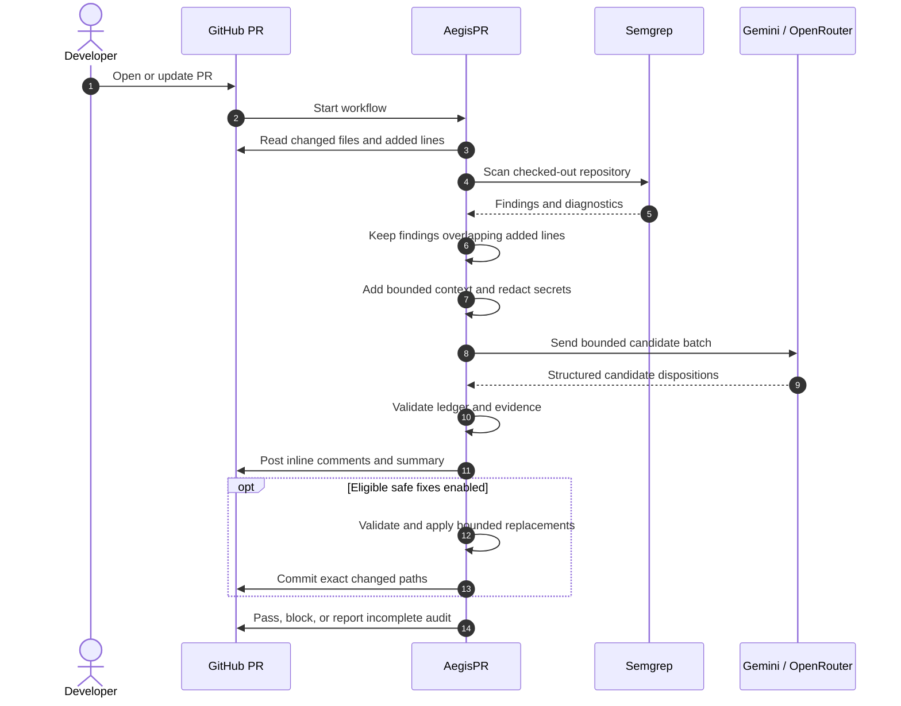

# AegisPR

<p align="center">
  
</p>

<p align="center">Evidence-led security review for GitHub pull requests.</p>

AegisPR combines a versioned Semgrep ruleset with Gemini or OpenRouter triage. It scans the repository, keeps detector findings that overlap added pull-request lines, adds bounded context, and requires the AI provider to return a validated disposition for every candidate.

It complements code review and testing. It does not replace penetration testing, dynamic analysis, dependency scanning, or human security review.

## Highlights

- **Reproducible detector floor** — bundled Semgrep rules are versioned with the action.
- **Exact PR scope** — comments and blocking decisions are anchored to added lines.
- **Evidence-led triage** — every candidate receives a stable ID and validated disposition.
- **Fail-closed completeness** — timeouts, invalid output, and missing verdicts cannot silently produce a clean result.
- **Gemini and OpenRouter** — use either provider or automatic failover with both keys.
- **Bounded, redacted context** — common credential patterns are redacted before repository context is sent to an AI provider.
- **Conservative remediation** — only eligible, high-confidence runtime fixes reach the automatic patch path.
- **Configurable gates** — choose blocking severities, batching, scan mode, exclusions, and audit limits.

## Coverage

### Bundled Semgrep rules

The deterministic rules cover selected patterns in Python, JavaScript/TypeScript, Go, Java, and C#.

| Weakness family | Bundled coverage |
|---|---|
| SSRF | User-controlled URLs reaching outbound request APIs |
| TOCTOU | Filesystem check-then-use sequences |
| SQL injection | Express request data reaching raw Sequelize queries |
| Open redirect | Express request data reaching redirect sinks |
| Command injection | Express request data reaching shell execution |
| Path traversal | Express request data reaching filesystem sinks |
| Code injection | Express request data reaching dynamic evaluation |
| Unsafe deserialization | Express request data reaching known unsafe deserializers |
| Authorization review | Request-controlled IDs reaching direct data lookups |
| XSS | Express request data reaching HTML or DOM sinks |
| Embedded secrets | Selected private-key and HMAC-key literals in JS/TS runtime code |

`semgrep_rule_mode: extended` adds live Semgrep Registry packs. Extended mode requires network access and is less reproducible because Registry content can change independently of AegisPR.

### AI-assisted analysis

The AI provider receives bounded context around Semgrep candidates. It can validate data flow, reduce false positives, consolidate duplicates, explain impact, and identify related semantic problems visible in that context.

The AI does **not** independently read every changed line or guarantee coverage for languages without a detector candidate. AegisPR also does not currently run an ecosystem CVE scanner such as OSV-Scanner.

## How it works


```mermaid
sequenceDiagram
    autonumber
    actor Developer
    participant GH as GitHub PR
    participant Action as AegisPR
    participant Semgrep
    participant AI as Gemini / OpenRouter

    Developer->>GH: Open or update PR
    GH->>Action: Start workflow
    Action->>GH: Read changed files and added lines
    Action->>Semgrep: Scan checked-out repository
    Semgrep-->>Action: Findings and diagnostics
    Action->>Action: Keep findings overlapping added lines
    Action->>Action: Add bounded context and redact secrets
    Action->>AI: Send bounded candidate batch
    AI-->>Action: Structured candidate dispositions
    Action->>Action: Validate ledger and evidence
    Action->>GH: Post inline comments and summary
    opt Eligible safe fixes enabled
        Action->>Action: Validate and apply bounded replacements
        Action->>GH: Commit exact changed paths
    end
    Action->>GH: Pass, block, or report incomplete audit
```

## Quick start

### 1. Add an AI-provider secret

In **Settings → Secrets and variables → Actions**, add at least one of:

- `GEMINI_API_KEY`
- `OPENROUTER_API_KEY`

With both configured, `ai_provider: auto` can fail over between them.

### 2. Add a workflow

Create `.github/workflows/aegispr.yml` in the repository you want to review:

```yaml
name: AegisPR

on:
  pull_request:
    types: [opened, synchronize, reopened]

jobs:
  review:
    if: github.actor != 'github-actions[bot]' && github.event.pull_request.head.repo.fork == false
    runs-on: ubuntu-latest
    permissions:
      contents: write
      pull-requests: write

    steps:
      - name: Checkout pull request
        uses: actions/checkout@v7
        with:
          ref: ${{ github.event.pull_request.head.sha }}
          persist-credentials: false

      - name: Run AegisPR
        uses: AlaeddinSrour/AegisPR@main
        with:
          github_token: ${{ secrets.GITHUB_TOKEN }}
          gemini_api_key: ${{ secrets.GEMINI_API_KEY }}
          openrouter_api_key: ${{ secrets.OPENROUTER_API_KEY }}
          ai_provider: auto
          findings_per_batch: '8'
          semgrep_rule_mode: bundled
          fail_on_incomplete: 'true'
```

For production, pin `AlaeddinSrour/AegisPR` to a reviewed release tag or full commit SHA instead of `main`.

The included self-review workflow uses a separate trusted checkout of the base revision. This prevents pull-request code from replacing the action implementation that reviews it.

## Configuration

| Input | Default | Description |
|---|---:|---|
| `github_token` | required | GitHub token used for PR metadata, comments, and enabled fix pushes |
| `gemini_api_key` | empty | Gemini credential; required when Gemini is selected |
| `openrouter_api_key` | empty | OpenRouter credential; required when OpenRouter is selected |
| `ai_provider` | `auto` | `auto`, `gemini`, or `openrouter` |
| `findings_per_batch` | `8` | Maximum detector candidates per AI batch, from 1 through 20 |
| `semgrep_rule_mode` | `bundled` | `bundled` or `extended` |
| `semgrep_exclusions` | `.git,.venv,node_modules` | Comma-separated paths excluded from Semgrep |
| `max_target_bytes` | `1000000` | Maximum size of one Semgrep target file |
| `max_diff_chars` | `300000` | Maximum accepted PR diff size in characters |
| `workspace_subdirectory` | `.` | Audited repository path relative to `GITHUB_WORKSPACE` |
| `apply_fixes` | `true` | Enable eligible safety-validated automatic fixes |
| `fail_on_incomplete` | `true` | Fail when detector or AI completeness is unknown |
| `openrouter_allow_data_collection` | `false` | Allow OpenRouter routes whose providers may retain prompts |
| `blocking_severities` | `CRITICAL,HIGH` | Comma-separated confirmed severities that fail the job |

## Results and remediation

AegisPR posts inline comments only when the canonical sink overlaps an added PR line. It posts a summary when inline placement is unavailable or additional context is needed.

Automatic fixes are limited to runtime or unclassified code, non-low-confidence findings, and findings explicitly marked for automatic remediation. Changes use bounded replacements, atomic file writes, and exact-path staging. Python and JSON changes receive syntax validation.

SSRF, open redirect, TOCTOU, and embedded-secret findings always require manual remediation because a safe correction depends on application policy, destination allowlists, atomicity requirements, or credential rotation.

## Security and privacy

- Repository content is treated as untrusted prompt data.
- Common credentials and secret-like values are redacted locally before AI submission.
- Credentials are not intentionally included in logs or prompts.
- OpenRouter routes that may collect prompts are disabled unless explicitly allowed.
- The included workflow skips fork PRs because ordinary fork workflows do not receive repository secrets.
- Workflow files are excluded from automatic changes.
- Workspace paths and changed filenames are validated before filesystem operations.

Only bounded finding context is sent, but excerpts can still contain sensitive business logic. Review your AI provider's retention and privacy terms before enabling the action.

## Limitations

- Static rules can miss vulnerabilities and produce false positives.
- AI triage can be wrong, unavailable, rate-limited, or slow.
- Coverage is detector-led; this is not a complete semantic review of the entire PR.
- Only added PR lines are eligible for comments and blocking findings, so legacy vulnerabilities outside the diff are not reported.
- AegisPR does not perform dynamic testing, runtime exploitation, container scanning, malware analysis, or dependency/CVE resolution.
- Large files and oversized diffs are bounded by configuration.
- Extended rules depend on the availability and current contents of the Semgrep Registry.
- Passing AegisPR does not prove that a pull request is secure.

## Troubleshooting

| Symptom | What to check |
|---|---|
| Audit is incomplete | Inspect Semgrep diagnostics and AI timeout/rate-limit messages; keep `fail_on_incomplete: true` |
| No AI provider available | Configure the key required by `ai_provider`, or both keys for `auto` |
| Diff exceeds the boundary | Split the PR or deliberately raise `max_diff_chars` |
| Large source file is skipped | Raise `max_target_bytes` after reviewing runner resource limits |
| Extended scan fails | Confirm Registry network access or use `bundled` mode |
| Fork PR is skipped | Use a secured workflow that never exposes write tokens or provider secrets to untrusted code |
| Fix was not applied | Check `apply_fixes`, confidence, runtime scope, remediation type, syntax validation, and branch permissions |

## Development

```bash
python -m pip install -r requirements-dev.txt
python -m ruff check src tests aegispr_action.py
python -m pytest --cov=src --cov-fail-under=75
```

The tests cover diff parsing, Semgrep completeness, multi-language rules, batching and ledger validation, provider behavior, redaction, scope classification, GitHub operations, fuzzy replacement, fix safety, and action metadata.

## Repository layout

```text
├── .github/workflows/       # CI and self-review workflows
├── src/
│   ├── aegispr_rules.yml    # Versioned multi-language Semgrep rules
│   ├── semgrep_runner.py    # Scanning, diagnostics, IDs, and PR-line filtering
│   ├── triage.py            # Batching and disposition-ledger validation
│   ├── gemini_client.py     # Gemini structured-output client
│   ├── openrouter_client.py # OpenRouter structured-output client
│   ├── github_ops.py        # Comments and validated fix commits
│   └── ...                  # Context, scope, models, prompts, and safety helpers
├── tests/                   # Unit and multi-language detector regression tests
├── action.yml               # GitHub Action inputs and container definition
├── Dockerfile               # Action runtime image
├── aegispr_action.py        # Trusted container entrypoint
└── requirements*.txt        # Runtime and development dependencies
```
