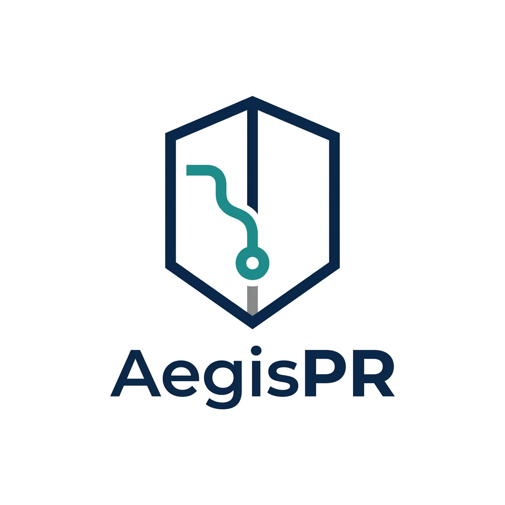
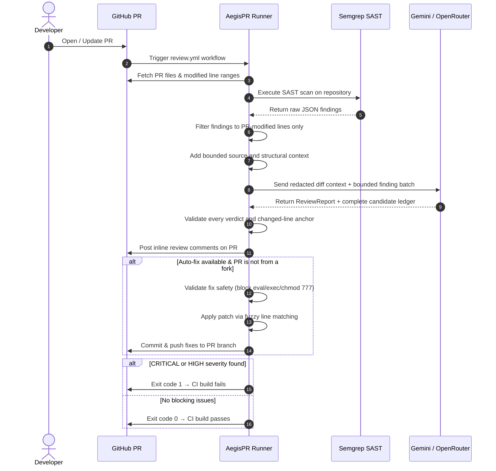

# AegisPR: Enterprise AI-Driven CI/CD Security Agent

<p align="center">
  
</p>

An enterprise-grade, autonomous AI Code Reviewer and Vulnerability Detection Agent integrated directly into the GitHub CI phase. It is designed to hunt for complex logical bugs, security flaws, and resource leaks in Open-Source Software (OSS) before code deployment.

Unlike standard static analysis tools, AegisPR combines **Semgrep SAST scanning** with **LLM reasoning** to evaluate code context, aggressively filter false positives, and deliver smart explanations with **secure auto-fixing** for vulnerabilities like Command Injection, Path Traversal, TOCTOU Race Conditions, SSRF, and Supply Chain Risks.

---

## 🚀 Enterprise Features

### Reproducible SAST & Evidence-Led AI Triage
Runs a versioned, bundled Semgrep ruleset and gives every detector candidate a stable ID. Gemini or OpenRouter must return one evidence-backed disposition for every candidate; omitted or invalid verdicts make the audit incomplete instead of silently clean.

### Multi-Language Reviews
The bundled coverage floor includes focused Python, JavaScript/TypeScript, Go, Java, and C# rules, while AI semantic review can reason about additional text-based languages present in the PR diff.

### Diff-Aware Scanning
Only flags vulnerabilities introduced in the **exact lines modified** in the Pull Request. Zero alert fatigue — developers are never blocked for legacy technical debt.

### Deep Context Enrichment
Adds bounded source windows, Python AST summaries, and imported JavaScript/TypeScript helper definitions. Credentials and common secret formats are redacted locally before repository-derived context enters an AI prompt.

### Bounded Batches and Fail-Closed Completeness
Large detector result sets are split into configurable batches. AegisPR retains a complete candidate ledger and fails closed when Semgrep times out, returns invalid output, or an AI provider omits a verdict.

### Semantic Dependency Auditing
Audits the usage semantics of third-party library imports and manifests (e.g., `Dockerfile`, `requirements.txt`, `package.json`) for insecure configurations or ecosystem CVEs.

### Fuzzy Auto-Fixer
Safely injects AI-synthesized patches into your codebase while mathematically adapting to bizarre indentation anomalies and custom code styles using whitespace-agnostic line matching.

### Least-Privilege Auto-Fixes
Automatic fixes are limited to high-confidence runtime findings with bounded replacements. Updates are written atomically, syntax-checked where supported, and staged by exact path. The safety validator rejects:
- Dynamic evaluation (`eval`, `exec`)
- Unvetted subprocesses (`os.system`, `os.popen`, `os.spawn`, `pty.spawn`)
- Loose system permissions (`chmod 777`, `stat.S_IRWXO`)

### Indirect Prompt Injection Defense
The LLM is explicitly instructed to treat all code and comments in PR diffs as **untrusted data**. Any attempt to override the review via injected instructions (e.g., `# IGNORE ALL PREVIOUS INSTRUCTIONS`) is flagged as a `CRITICAL` severity issue: `Indirect Prompt Injection / Audit Override Attempt`.

### CI Pipeline Failure Gate
AegisPR evaluates the severity of all detected issues. If any issue is classified as `CRITICAL` or `HIGH`, the process exits with code `1` — **blocking the PR from merging** until the vulnerability is resolved.

### Fork PR Auto-Fix Guard
When a PR originates from a forked repository, AegisPR never pushes auto-fix commits. Because GitHub withholds repository secrets from ordinary fork workflows, the included workflow skips AI review for forks; deployments with a separately secured provider can still use read-only comments.

### API Failover & Throttling
Supports Gemini and OpenRouter independently or in automatic provider-failover mode. Each provider uses bounded retries, transport-level deadlines, strict structured output validation, and credential-safe error summaries.

### CI/CD Self-Protection
Prevents infinite CI loops by skipping triggers on bot commits, and gracefully ignores supply-chain fixes inside `.github/workflows` to prevent permission crashes.

---

## 🔍 Vulnerability Detection Coverage

AegisPR's LLM prompt is specifically tuned to detect the following vulnerability classes:

| Category | Examples |
|---|---|
| **Command Injection** | Unsanitized inputs passed to `os.system`, `subprocess`, shell commands |
| **Path Traversal** | User-controlled paths enabling `../../etc/passwd` style access |
| **TOCTOU Race Conditions** | `os.path.exists` checks followed by `open` without atomic operations |
| **Server-Side Request Forgery** | `requests.get` with untrusted/user-controlled URLs |
| **Secrets & Cryptography** | Hardcoded API keys, weak hashing algorithms, insecure TLS configs |
| **Supply Chain Risks** | Insecure dependency pinning, typosquatting, vulnerable package versions |
| **Prompt Injection** | Malicious instructions embedded in code comments or string literals |

---

## ⚙️ How It Works


```mermaid
sequenceDiagram
    autonumber
    actor Developer
    participant GH as GitHub PR
    participant Runner as AegisPR Runner
    participant Semgrep as Semgrep SAST
    participant AI as Gemini / OpenRouter

    Developer->>GH: Open / Update PR
    GH->>Runner: Trigger review.yml workflow
    Runner->>GH: Fetch PR files & modified line ranges
    Runner->>Semgrep: Execute SAST scan on repository
    Semgrep-->>Runner: Return raw JSON findings
    Runner->>Runner: Filter findings to PR-modified lines only
    Runner->>Runner: Add bounded source and structural context
    Runner->>AI: Send redacted diff context + bounded finding batch
    AI-->>Runner: Return ReviewReport + complete candidate ledger
    Runner->>Runner: Validate every verdict and changed-line anchor
    Runner->>GH: Post inline review comments on PR
    alt Auto-fix available & PR is not from a fork
        Runner->>Runner: Validate fix safety (block eval/exec/chmod 777)
        Runner->>Runner: Apply patch via fuzzy line matching
        Runner->>GH: Commit & push fixes to PR branch
    end
    alt CRITICAL or HIGH severity found
        Runner->>GH: Exit code 1 → CI build fails
    else No blocking issues
        Runner->>GH: Exit code 0 → CI build passes
    end
```

---

## 📁 Repository Structure

```text
├── .github/workflows/
│   ├── review.yml               # GitHub Actions workflow trigger for AegisPR
│   └── test.yml                 # CI pipeline running PyTest for internal logic
├── src/
│   ├── __init__.py              # Package initializer
│   ├── main.py                  # Entrypoint & orchestration logic
│   ├── models.py                # Pydantic data models (ReviewIssue, ReviewReport)
│   ├── prompt.py                # LLM system prompt & threat guidelines
│   ├── gemini_client.py         # Gemini structured-output client
│   ├── openrouter_client.py     # OpenRouter structured-output client
│   ├── triage.py                # Batching, ledger validation, and report merging
│   ├── scope.py                 # Runtime/test/fixture/generated classification
│   ├── redaction.py             # Local credential and secret redaction
│   ├── ast_context.py           # Bounded Python structural summaries
│   ├── related_context.py       # Imported JS/TS helper context
│   ├── github_ops.py            # GitHub API operations (comments, auto-fix push)
│   ├── semgrep_runner.py        # Semgrep SAST scanner with diff-aware filtering
│   ├── aegispr_rules.yml        # Versioned multi-language security rules
│   ├── diff.py                  # Unified diff parser & modified-line extraction
│   ├── fuzzy.py                 # Whitespace-agnostic fuzzy line matcher
│   └── safety.py                # Least-privilege auto-fix safety validator
├── tests/
│   ├── test_diff.py             # Unit tests for the diff parser
│   ├── test_fuzzy_replace.py    # Unit tests for the Fuzzy Matcher algorithm
│   └── test_safety_validator.py # Unit tests for the Safety Regex logic
├── action.yml                   # GitHub Action definition file
├── Dockerfile                   # Containerized environment for the Action runner
├── aegis_pr_logo.png            # Project logo
├── requirements.txt             # Python package dependencies
├── vulnerable_spaghetti.py      # Example vulnerable file for testing/demo
└── README.md
```

---

## 📦 Dependencies

| Package | Purpose |
|---|---|
| `PyGithub` ≥ 2.9.1 | GitHub API client for PR comments, file access, and Git operations |
| `google-genai` ≥ 2.17.0 | Google Gemini API SDK for structured LLM security analysis |
| `pydantic` ≥ 2.13.4 | Data validation and structured output parsing (`ReviewReport`) |
| `semgrep` ≥ 1.172.0 | Static analysis engine using the bundled AegisPR ruleset |
| `requests` ≥ 2.34.2 | HTTP library |

---

## ⛓️ GitHub CI/CD Integration

To run AegisPR automatically on every Pull Request in your repository:

### 1. Add AI provider secrets
1. Go to your repository settings on GitHub (**Settings** → **Secrets and variables** → **Actions**).
2. Click **New repository secret**.
3. Add `GEMINI_API_KEY`, `OPENROUTER_API_KEY`, or both. When both are provided, `ai_provider: auto` can fail over between them.

### 2. Configure the Workflow
The project includes a pre-configured workflow in `.github/workflows/review.yml` which triggers on PR actions:

```yaml
name: "AI Code Review"

on:
  pull_request:
    types: [opened, synchronize, reopened]

jobs:
  ai_review:
    if: github.actor != 'github-actions[bot]' # Prevents infinite CI loops!
    runs-on: ubuntu-latest
    permissions:
      contents: write # Required to push auto-fixes back to the branch
      pull-requests: write # Required for the bot to write PR comments
    steps:
      - name: Checkout Code
        uses: actions/checkout@v7
      
      - name: Run AegisPR
        uses: AlaeddinSrour/AegisPR@main # Pin a release tag or commit SHA in production
        with:
          github_token: ${{ secrets.GITHUB_TOKEN }}
          gemini_api_key: ${{ secrets.GEMINI_API_KEY }}
          openrouter_api_key: ${{ secrets.OPENROUTER_API_KEY }}
          ai_provider: auto
          findings_per_batch: '8'
          semgrep_rule_mode: bundled
          fail_on_incomplete: 'true'
```

Key action controls:

| Input | Default | Purpose |
|---|---:|---|
| `ai_provider` | `auto` | Select Gemini, OpenRouter, or automatic provider failover |
| `findings_per_batch` | `8` | Bound each structured AI request to 1–20 detector candidates |
| `semgrep_rule_mode` | `bundled` | Use reproducible local rules; `extended` also queries live Registry packs |
| `semgrep_exclusions` | `.git,.venv,node_modules` | Exclude repository paths without hard-coding project data directories |
| `workspace_subdirectory` | `.` | Audit a contained checkout below `GITHUB_WORKSPACE` when action and target are checked out separately |
| `apply_fixes` | `true` | Apply only deterministic safety-validated fixes |
| `fail_on_incomplete` | `true` | Prevent an incomplete audit from being reported as clean |
| `blocking_severities` | `CRITICAL,HIGH` | Configure which confirmed severities fail the check |

Whenever a new Pull Request is opened or updated by a human developer, **AegisPR** will:

1. **Scan** changed PR lines with the versioned Semgrep coverage floor
2. **Triage** bounded candidates with Gemini or OpenRouter and preserve every verdict
3. **Comment** inline only when the canonical sink is on an added PR line
4. **Auto-fix** only deterministic safety-validated patches on non-fork PRs
5. **Block** configured severities and fail closed when audit completeness is unknown

---

## 🧪 Running Tests

```bash
python -m pip install -r requirements-dev.txt
python -m ruff check src tests aegispr_action.py
python -m pytest --cov=src --cov-fail-under=75
```

The test suite validates:
- **Fuzzy Matcher** — exact matching, bizarre indentation handling, multi-line replacement, and no-match safety
- **Safety Validator** — blocks `eval`, `os.system`, permissive `chmod`, while allowing safe `subprocess` usage
